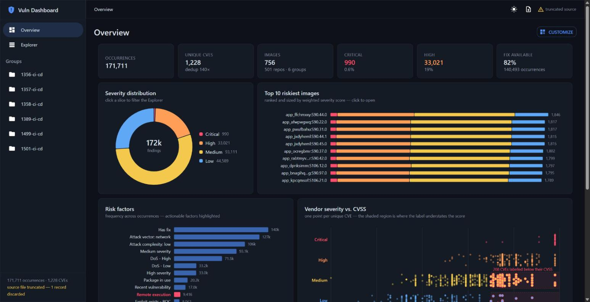

# Security Vulnerability Dashboard

A React + TypeScript dashboard that ingests a **270MB nested container-image
vulnerability scan** and makes it explorable across groups, repos, images,
packages, and CVEs — with the main thread never blocking.

171,711 vulnerability occurrences · 1,228 unique CVEs · 756 images · 501 repos

**Live demo:** <https://vuln-dash.vercel.app>

> ### 📂 Reviewers: run it on the real file
>
> The live demo serves a committed **44MB sample** (4 groups · 69 repos ·
> 28,375 records) because the full 270MB scan exceeds free-tier hosting limits.
>
> **Use the upload button in the app header to load your own `ui_demo.json`** —
> the full 171,711-record scan, in the deployed app, no install required. It
> streams through the identical worker pipeline (same tokenizer, same
> normalizer, same aggregation) and is **parsed entirely in your browser; the
> file is never uploaded anywhere**. The app says so on screen too.
>
> Prefer running it locally? See [Setup](#setup) — three commands.



---

## Contents

- [Setup](#setup)
- [What it does](#what-it-does)
- [The data](#the-data-read-before-the-code)
- [Handling 270MB](#handling-270mb)
- [Data model](#data-model)
- [Technical decisions](#technical-decisions)
- [Documentation map](#documentation-map)
- [Accessibility & responsive](#accessibility--responsive)
- [Testing](#testing)
- [Production considerations](#production-considerations)
- [What I'd do with more time](#what-id-do-with-more-time)
- [A note on extensibility](#a-note-on-extensibility)

---

## Setup

Requires Node 20+.

```bash
git clone <repo-url>
cd vuln-dashboard
npm install

# The scan file is 270MB and is NOT committed. Place it here:
cp /path/to/ui_demo.json public/ui_demo.json

npm run dev          # http://localhost:5173
```

To point at a remotely hosted copy instead of `public/`, set `VITE_DATA_URL`:

```bash
VITE_DATA_URL=https://example.com/ui_demo.json npm run dev
```

### The deployed demo runs on a sample — and why

The full scan is 270MB, which exceeds free-tier hosting limits (~100MB) and is
too large to commit. The deployment therefore serves
`public/ui_demo.sample.json` — whole repos taken from the source file, so the
nested schema is identical and **the ingest path is byte-for-byte the same**:
same streaming tokenizer, same normalizer, same aggregation, same worker. Only
the row count differs.

**Or skip the sample entirely:** the upload button in the app header (also
offered on ingest errors) streams any scan JSON straight from disk through the
same worker pipeline via `File.stream()`. Nothing leaves the browser — so the
live demo can ingest the full 270MB file at full scale, client-side, if you
have a copy locally.

```bash
npm run make-sample -- /path/to/ui_demo.json          # writes public/ui_demo.sample.json (~45MB)
npm run build                                          # .env.production points at the sample
```

All performance numbers in this README were measured against the **full 270MB
file** locally, not the sample.

Other scripts:

```bash
npm run test         # Vitest units on the pure ingest/selector layers
npm run typecheck    # tsc --noEmit, strict
npm run build        # typecheck + production build

node scripts/inspect-data.mjs path/to/ui_demo.json   # Phase 0 recon report
npm run ingest-node -- path/to/ui_demo.json          # full pipeline in Node, measured
```

The Node scripts are dependency-free and were how the data was characterized
before any UI code was written — see [`docs/PHASE0-FINDINGS.md`](docs/PHASE0-FINDINGS.md).

---

## What it does

> Looking for a specific assignment requirement? **[docs/REQUIREMENTS.md](docs/REQUIREMENTS.md)**
> maps every line of the brief to its implementation, code path, and rationale.

| Route | View |
|---|---|
| `/` | Overview — six stat cards and six visualizations |
| `/explorer` | Virtualized grid over all 171,711 occurrences with filters, search, export |
| `/groups/:id` | Repos in a group, ranked by weighted risk |
| `/groups/:id/repos/:id` | Image versions in a repo |
| `/images/:id` | Image metadata, vulnerabilities grouped by package |
| `/cve/:cveId` | CVE detail and every image/package it affects |
| `/compare` | Side-by-side comparison of up to 4 staged CVEs |

**Triage actions.** The scan carries an undocumented `kaiStatus` field on ~12%
of records — the scanner's own dismissal verdicts, split between manual
(`invalid - norisk`) and AI (`ai-invalid-norisk`) analysis. The **Analysis**
and **AI Analysis** buttons each exclude one verdict. Each button shows how
many records it would remove *within the current filter context* (not
globally), and an impact bar animates the shown/removed proportions on toggle.

**Search with live suggestions.** One field searches CVE IDs and package names
at once, with grouped autocomplete drawn from the deduped catalog and the
distinct package vocabulary collected at ingest — suggestions from two
characters, and free-text substring search still works if you ignore them.
Debounced with a local echo so typing never stalls.

**Customizable Overview.** The default dashboard is a *default*: widgets drag,
snap, resize, hide and restore on a 12-column grid, and a builder composes new
charts from seven data dimensions × three chart forms with a live preview.
Layout, hidden set and custom charts persist. The builder reads only
precomputed aggregates — user-composed charts can't break the no-aggregation-
on-the-main-thread rule.

**Fix first.** The Explorer continuously recomputes the most dangerous distinct
CVEs in the *current* view — actively-exploited first, then severity, then
CVSS — and surfaces them as chips above the grid, with matching rows given a
critical accent rail. Unfiltered, this correctly surfaces Log4Shell
(`CVE-2021-44228`).

---

## The data (read before the code)

Four levels deep, and the first three are **objects keyed by name, not
arrays** — which rules out naive array streaming:

```
{ groups: { "<name>": { repos: { "<name>": { images: { "<version>": {
      name, version, baseImage, buildType, maintainer, createTime,
      vulnerabilities: [ { cve, severity, cvss, riskFactors, ... } ]
} } } } } } }
```

Phase 0 was a streaming inspection pass over the full file before any UI
existed. It found things that changed the design:

| Finding | Consequence |
|---|---|
| **The file is truncated** — ends mid-string inside an image object, ~0.5MB unparsed tail | `JSON.parse` and any clean-EOF parser fail outright. Ingest emits *complete image objects* and reports the tail as a quantified condition, surfaced in the UI header — not silently swallowed |
| **139.8× redundancy** — every CVE repeats its full description at every occurrence; 75.0MB of the 270MB is description text, 74.5MB of it duplicated | Dedupe into a CVE catalog; occurrences hold only the ID. The single highest-leverage decision in the project |
| **`cve` is not unique** — same CVE hits multiple packages in one image | Composite key `group\|repo\|version\|pkg@ver\|cve`. 3 records collide even on that (identical vuln listed twice) — disambiguated and counted |
| **`severity` and `cvss` disagree by design** — 227 unique CVEs score CVSS ≥ 7 while labeled low/medium | Never derive one from the other. Both stored. This became a chart |
| **`riskFactors` is an object-as-set** — `{"Has fix": {}}`, values always empty | Flatten to keys. 13 distinct labels total |
| **Malformed unicode** — literal `u00a0` ×21,658, `u2019` ×1,923, `\'` ×18,713 (backslashes lost upstream) | Sanitize only the codepoints actually observed; a blanket `/u[0-9a-f]{4}/` sub would corrupt legitimate text |
| **Epoch-zero sentinel** — `1970-01-01 00:00:00` on 8,782 layerTimes, 31,218 fixDates | Maps to `null` |
| **Non-ISO dates** — `"2024-03-20 13:58:02"`, 100% consistent, zero deviations | Manual UTC parse (`new Date(string)` is unreliable across browsers), stored as epoch ms |
| **Six always-empty fields** across all 171,711 records | Verified, then dropped at ingest |
| **CVE metadata isn't globally consistent** — 55 CVEs carry conflicting CVSS, 83 conflicting severities; descriptions are 100% consistent | Catalog keeps max CVSS / worst severity (documented); per-occurrence values stay authoritative on the row. The CVE page flags when a CVE is one of the 83 |

---

## Handling 270MB

### Why `fetch().json()` fails

It holds the raw text and the parsed tree simultaneously — roughly 900MB–1.2GB
peak — and blocks for the entire parse. And on *this* file it never completes
at all, because the file is truncated.

### What's built instead

A **Web Worker** streams the response through a string-aware brace-depth
tokenizer (`src/workers/tokenizer.ts`) that emits each complete image object
the moment its closing brace arrives. Peak transient memory is one image
object — 1.3MB at the largest, measured. Zero parsing dependencies.

Everything happens in one pass inside the worker: tokenize → normalize →
sanitize → intern → dedupe → aggregate. The main thread receives progress
messages and one finished payload. **It never sees a raw record and never
computes an aggregate.**

Progress is a real percentage from `Content-Length`, not a spinner.

### Measured

| Metric | Value |
|---|---|
| Parse + normalize (Node harness, same code as the worker) | **4.0s** |
| Aggregation | 0.05s |
| Browser time-to-interactive, cold, dev server | ~40s (dominated by dev-server byte delivery, not parsing) |
| **Main-thread long tasks during ingest** | **0 — zero blocking, measured with `PerformanceObserver`** |
| Peak RSS (Node harness) | 333MB |
| Peak transient parse memory | 1.3MB (one image object) |
| Normalized dataset, JSON-serialized | ~60MB |
| Dedup ratio | **139.8×** (171,711 occurrences → 1,228 CVEs) |
| Description bytes deduped away | 74.5MB of 75.0MB |
| Explorer filter+sort over 171,711 rows | 10–40ms |

The zero-long-task number is the one that matters: the UI stays fully
interactive throughout ingestion, and the progress bar animates smoothly
because nothing ever blocks the main thread.

---

## Data model

```ts
Dataset {
  cveCatalog: Map<string, CveMeta>   // 1,228 entries — deduped descriptions
  occurrences: Occurrence[]          // 171,711 lightweight rows
  imageMeta: ImageMeta[]
  groupNames: string[]               // interned; index === groupId
  repoNames: string[]
  aggregates: Aggregates             // everything the charts need, precomputed
  diagnostics: IngestDiagnostics     // truncation, failures, timing
}
```

**Catalog/occurrence split.** Descriptions are 27.8% of the file and 99.3%
duplicated. Storing them once is what makes the dataset fit in a normal tab.

**String interning.** Group and repo names are long registry paths
(`quay.example.priv/1356-ci-cd/app_gonzfixi`). Occurrences hold numeric indices
into interned tables instead of repeating those strings 171,711 times.

**What the split buys.** `/cve/:cveId` — "every image and package affected by
this CVE, across the whole estate" — is a cross-cutting query that would be
prohibitive without deduplication. The top CVE has 1,787 occurrences and the
page renders instantly. That route exists *because* of the data model.

---

## Technical decisions

### Redux for UI state; the dataset deliberately outside it

Redux holds ingestion status, filters, sort, pagination, preferences, and the
comparison set — all small and serializable. The dataset lives in a
module-level singleton exposed through `DatasetProvider`, because it's
immutable after ingestion and needs no reducer.

Putting a 60MB object graph in a slice would hang Redux DevTools, which
serializes every action payload. With it excluded, state is tiny enough that
RTK's `serializableCheck` and `immutableCheck` stay **on** in dev — they're
exactly the guard that would catch someone accidentally dispatching the
dataset into a slice.

### D3 calculates, React renders

No `d3.select()`, no imperative DOM mutation. D3 computes scales, arcs, stacks,
bins, and ticks inside `useMemo`; React renders the SVG. Single source of truth
for the DOM, no imperative/declarative conflict, and charts participate
normally in reconciliation and MUI theming.

Every chart takes `width`/`height` props from a `ResponsiveChart` wrapper
(`ResizeObserver`), reads colors from the theme, and handles the empty case.

### Code splitting and lazy loading

Every route except the landing Overview is a `React.lazy` chunk behind a single
`Suspense` boundary in the layout, so the 664KB DataGrid bundle downloads only
when someone opens the Explorer. `manualChunks` pins `react-vendor`, `mui`,
`datagrid` and `d3` into stable vendor bundles, so shipping an app change
doesn't invalidate a returning user's cached libraries.

### Virtualization *and* pagination

MUI X DataGrid virtualizes rows within a page; pagination caps the working set
at 100. Both together: the DOM holds a viewport's worth of rows regardless of
whether 171,711 or 500 rows match.

Filtering and sorting live in `data/selectors.ts`, not in the grid —
`sortingMode="server"` means the grid reports intent and the memoized selector
owns the work. Sorting uses decorate–sort–undecorate: extracting sort keys once
per row instead of per comparison took a CVSS sort from 636ms to ~60ms.

### Theming

A `severity` palette is augmented onto the MUI theme rather than hardcoded, so
charts and primitives read from one place. The scale is deliberately not stock
red/yellow/green — low is blue, because green reads as "safe" and a low-severity
finding isn't safe. Every severity color was checked programmatically against
both background layers: **all ≥ 5.38:1**, comfortably past WCAG AA.

---

## Documentation map

| Document | What it answers |
|---|---|
| **[docs/ARCHITECTURE.md](docs/ARCHITECTURE.md)** | Component hierarchy, end-to-end data flow, layer responsibilities, state ownership, shared hooks, where each performance technique lives |
| **[docs/DESIGN.md](docs/DESIGN.md)** | Why the UI looks and behaves as it does — insight-forward principle, severity scale semantics, interaction model, responsive strategy, a11y as design |
| **[docs/REQUIREMENTS.md](docs/REQUIREMENTS.md)** | Every assignment requirement mapped to its implementation, code path, and documentation — including the six places creativity was asked for |
| **[docs/PRESENTATION.md](docs/PRESENTATION.md)** | Walkthrough of the approach, and a five-minute demo path |
| **[docs/PHASE0-FINDINGS.md](docs/PHASE0-FINDINGS.md)** | The data reconnaissance pass, before any code was written |

## Accessibility & responsive

- Verified at **1707px, 1271px, and 851px** — sidebar collapses to a drawer
  below 900px, filter panel becomes a disclosure, charts reflow. Zero
  horizontal overflow at every width (two real overflow bugs were found and
  fixed this way).
- Global `:focus-visible` outlines, including MUI's `ButtonBase` which resets
  them.
- Chart click targets (donut arcs and legend, image bars, risk-factor bars) are
  focusable with `role="button"` and Enter/Space activation. The scatter's
  ~1,200 points are deliberately *not* individual tab stops — that would be a
  keyboard trap; its `aria-label` summarizes the finding instead and every CVE
  is reachable through the Explorer.
- Skip-to-content link, `main` landmark, labelled charts, live-region filter
  feedback.
- **Zero console errors or warnings.**

---

## Testing

```bash
npm run test
```

Units cover the pure layers where correctness is subtle:

- **`normalize.ts`** — every documented quirk: composite-key uniqueness for
  same-CVE-different-package, unicode repair, epoch-zero → null, riskFactors
  flattening, severity/CVSS divergence preserved rather than derived, string
  interning, and defensive failure *counting* (malformed records never throw).
- **`aggregate.ts`** — severity and package-type tallies, weighted image
  ranking, per-CVE scatter deduplication, trend bucketing with gap-year fill,
  manual-vs-AI overlap quadrants, and the empty-dataset case.
- **`selectors.ts`** — the two triage buttons independently and combined, and
  the property that keeps the UI honest: **tallies are scoped to the current
  filter context**, so a button's badge never claims to remove records that
  another filter already excluded.

---

## Production considerations

This is a client-only build against a static file, which is the right shape for
the exercise and the wrong shape for production. What would change:

- **Server-side pagination and filtering.** Cursor-based, with the filter
  predicate pushed into the query. The client should never hold 171,711 rows.
- **Server-side aggregation.** The Overview's charts are all rollups —
  precompute them per scan and serve a small summary document. Ingest becomes
  an ETL job, not a page load.
- **A real API.** GraphQL/Apollo would suit the drill-down hierarchy well
  (groups → repos → images → vulns is a graph), with normalized caching.
- **Incremental scans.** Full re-ingestion per scan is wasteful; diffing
  against the previous scan is both cheaper and more useful — "what's new since
  last week" is the question security teams actually ask.
- **Streaming the catalog first.** Descriptions could be lazy-loaded per CVE
  detail view rather than held in memory.

## What I'd do with more time

- **Saved views** — filter combinations are the unit of work for a security
  team, and they're currently ephemeral.
- **Package-centric route.** Packages are the real remediation unit — you
  upgrade `spring-web` once and fix 40 images. The data supports this; the
  route doesn't exist yet.
- **Trend by *scan*, not publication date.** The current trend chart plots CVE
  publication years because that's what a single scan can show. Real value is
  in the delta between scans.
- **Component tests.** The pure layers are tested; the components are verified
  by hand and by browser automation, not by Testing Library.
- **Virtualize the image detail accordion.** 58 package sections render fine,
  but an image with thousands would want the same treatment as the grid.
- **Deeper profiling of the ingest tokenizer.** 4.0s is acceptable but the
  byte-level scanning loop is the obvious hot path if it needed to be faster.

## A note on extensibility

The best evidence for the architecture is what it absorbed after the core was
built. Triage action buttons, CVE comparison, filtered exports, search
suggestions, a disclosure-trend chart, persisted column customization, a
row-peek drawer, and client-side upload of arbitrary scan files were all added
late — and none required touching the ingest pipeline's core, restructuring
state, or rewriting a component. Each landed in the layer designed for it: new
aggregates went in the worker, new filter logic in the selector layer, new UI
on the primitives. The catalog/occurrence split even made the upload feature
nearly free — a `File.stream()` is the same `ReadableStream` the fetch path
already consumed.
